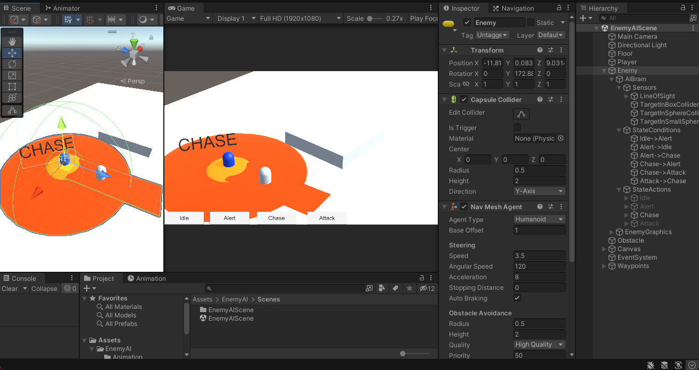
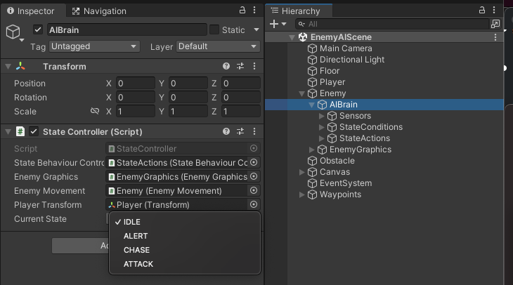
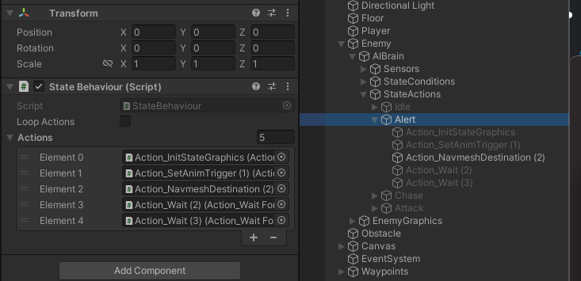
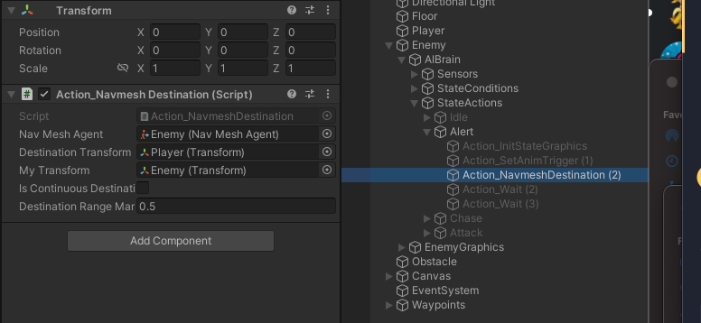
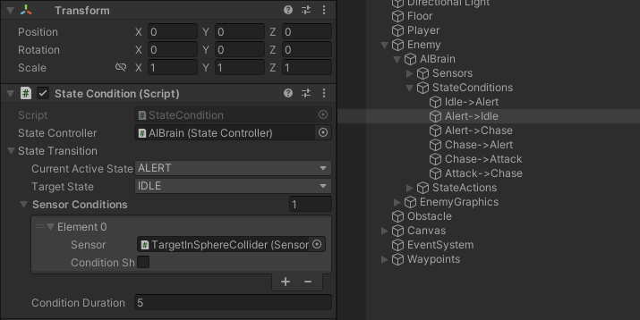
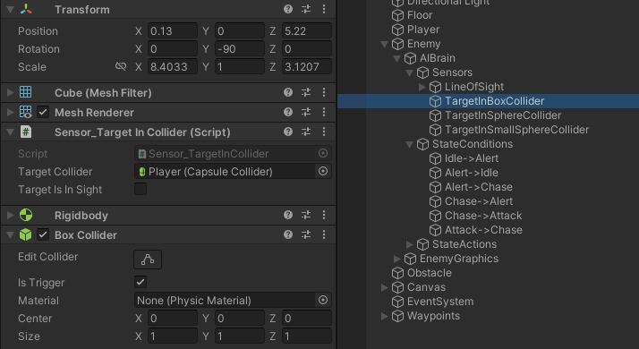

# ExampleEnemyAIUnity
Unity example project of Enemy AI with states, state conditions, sensors and loopable action sequences

## State Controller
The [State Controller](https://github.com/jackhoefnagel/ExampleEnemyAIUnity/blob/main/Assets/EnemyAI/Scripts/States/StateController.cs) is the heart of the operation. It is the main reference for States enum, it controls the switching of states, and has references to external scripts like Graphics and Movement, as well as the Player's Transform.

## State Behaviour

The [State Behaviour](https://github.com/jackhoefnagel/ExampleEnemyAIUnity/blob/main/Assets/EnemyAI/Scripts/States/StateBehaviour.cs), when activated by StateBehaviourController based on its corresponding State, goes through a sequence of Actions, either one time or looping.

## Action

A custom [Action](https://github.com/jackhoefnagel/ExampleEnemyAIUnity/blob/main/Assets/EnemyAI/Scripts/Actions/Action_NavmeshDestination.cs) needs to return a IsActionFinished() bool because it's derived from an Action class, but is completely configurable.

## State Conditions

Use [State Conditions](https://github.com/jackhoefnagel/ExampleEnemyAIUnity/blob/main/Assets/EnemyAI/Scripts/StateConditions/StateCondition.cs) to configure how to go from one state to another, based on Sensors, and configure how long these Sensors should be detecting something before transitioning to the target state.
The boolean can be inverted, meaning that you can have a State Condition that states that the detection should be false.

## Sensors

Configurable [Sensors](https://github.com/jackhoefnagel/ExampleEnemyAIUnity/blob/main/Assets/EnemyAI/Scripts/Sensors/Sensor_TargetInCollider.cs) that only should return a IsSensorConditionTrue() bool, can be used for range detection, line of sight, or other kinds of triggers.

